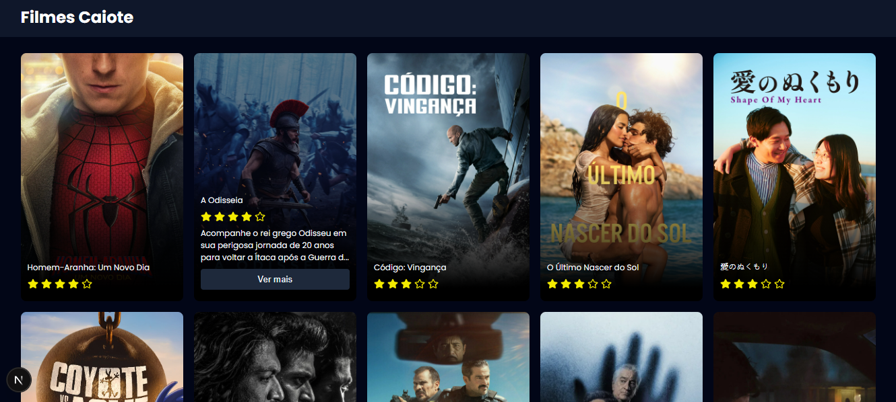

# Filmes Caiote

Aplicacao web para descobrir filmes populares em portugues do Brasil, consumindo dados da [API do TMDB](https://developer.themoviedb.org/reference/discover-movie). O projeto apresenta posters, titulos, sinopses resumidas e avaliacoes convertidas para estrelas.

## Preview



## Funcionalidades

- Listagem de filmes descoberta pela API do TMDB.

- Conteudo localizado em portugues do Brasil (`pt-BR`).

- Estado de carregamento enquanto os filmes sao buscados.

- Cards responsivos organizados em grid.

- Sinopse resumida e avaliacao exibida em estrelas.

- Interacao de hover para revelar informacoes adicionais do filme.

## Tecnologias

- [Next.js 16](https://nextjs.org/) com App Router

- [React 19](https://react.dev/)

- [TypeScript](https://www.typescriptlang.org/)

- [Axios](https://axios-http.com/) para requisicoes HTTP

- [Sass](https://sass-lang.com/) para estilos dos componentes

- [Tailwind CSS 4](https://tailwindcss.com/) via PostCSS

- [React Icons](https://react-icons.github.io/react-icons/) para as estrelas

- [Poppins](https://fontsource.org/fonts/poppins) via `@fontsource/poppins`

## Pre-requisitos

- Node.js 20.9 ou superior

- npm

- Uma chave de API do [TMDB](https://www.themoviedb.org/settings/api)

## Como executar

1. Clone o repositorio e entre na pasta do projeto:

	```bash

	git clone <url-do-repositorio>

	cd movies-app

	```

2. Instale as dependencias:

	```bash

	npm install

	```

3. Crie uma conta no [TMDB](https://www.themoviedb.org/) e gere sua propria chave de API em [Settings > API](https://www.themoviedb.org/settings/api).

4. Informe sua chave no parametro `api_key` do arquivo `app/components/MovieList/index.tsx`:

	```ts

	api_key: 'sua_chave_do_tmdb',

	```

	Use somente sua chave localmente, nao compartilhe esse valor e nao o publique no GitHub. Cada pessoa que executar o projeto deve gerar e usar sua propria chave.

5. Inicie o servidor de desenvolvimento:

	```bash

	npm run dev

	```

Abra [http://localhost:3000](http://localhost:3000) no navegador.

## Scripts disponiveis

| Comando | Descricao |

| --- | --- |

| `npm run dev` | Inicia o servidor de desenvolvimento |

| `npm run build` | Gera a build de producao |

| `npm start` | Executa a aplicacao em modo de producao |

| `npm run lint` | Verifica problemas de lint |

## Estrutura do projeto

```text

app/

├── components/

│   ├── MovieCard/       # Card individual de filme

│   ├── MovieList/       # Busca e listagem dos filmes

│   ├── NavBar/          # Barra de navegacao e titulo

│   └── StarRating/      # Conversao da nota em estrelas

├── types/movie.ts       # Tipagem dos dados de filme

├── globals.scss         # Estilos globais

├── layout.tsx           # Layout raiz e metadata

└── page.tsx             # Pagina inicial

public/                  # Arquivos estaticos

```

## TMDB

Este produto usa a API do TMDB, mas nao e endossado nem certificado pelo TMDB. Os dados e imagens dos filmes sao fornecidos pelo [The Movie Database](https://www.themoviedb.org/).

Para utilizar deve-se criar uma conta no site deles e gerar sua própria chave da API.

> **Importante:** no codigo atual, a requisicao ao TMDB e feita diretamente pelo navegador. Portanto, a chave pode ficar visivel nas requisicoes do cliente mesmo que nao seja commitada no repositorio. Para manter a chave realmente privada, sera necessario mover essa requisicao para uma rota de API no servidor.

## Deploy

O projeto pode ser publicado na [Vercel](https://vercel.com/) ou em qualquer ambiente compativel com Next.js. Antes do deploy, configure sua propria chave conforme as regras de seguranca do ambiente escolhido e nunca a inclua no repositorio.
